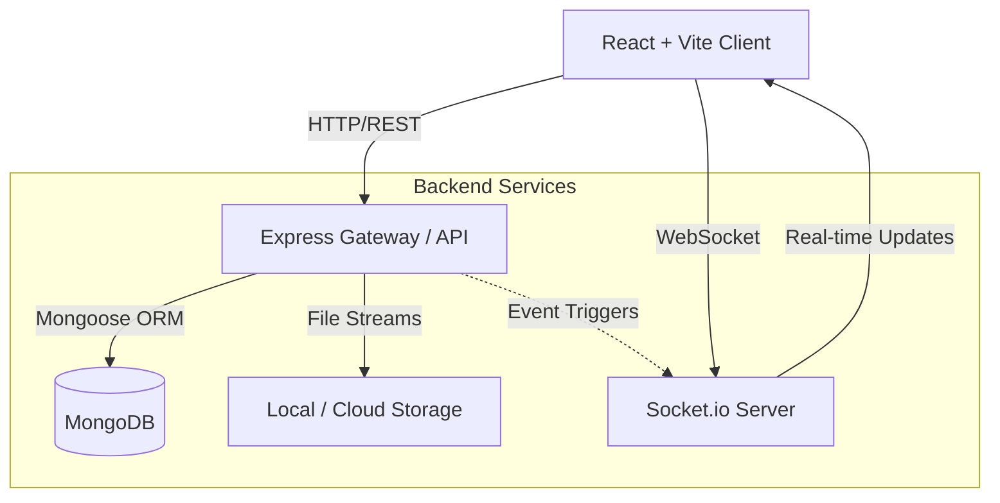

<div align="center">
  
  <h1>Attendy</h1>
  <p><strong>A Next-Generation Student Management System</strong></p>
  <p>Built for modern educational institutions, leveraging the power of MERN stack and real-time Socket communication.</p>

  <div>
    
    
    
  </div>
  <br />
</div>

## 📖 Table of Contents

- [Overview](#-overview)
- [System Architecture](#%EF%B8%8F-system-architecture)
- [Directory Structure](#-directory-structure)
- [Features](#-features)
- [API Documentation](#-api-documentation)
- [Getting Started](#-getting-started)
- [Future Enhancements](#-future-enhancements)

---

## 🎯 Overview

**Attendy** revolutionizes how schools manage daily operations. By bridging the gap between administrators, teachers, and students, Attendy ensures transparent communication, effortless attendance tracking, and comprehensive performance analytics—all in real-time.

---

## 🏗️ System Architecture

Attendy employs a robust client-server architecture with real-time bidirectional event handling. 



### Core Technologies
- **Frontend:** React 18, Vite, Tailwind CSS, Framer Motion, Recharts.
- **Backend:** Node.js, Express.js, Mongoose, Socket.io, PDFKit, Multer.
- **Security:** Helmet, express-rate-limit, JWT, bcryptjs.

---

## 📂 Directory Structure

The project follows a standard monorepo-style structure, separating the frontend and backend environments.

```text
Attendy/
├── backend/
│   ├── src/
│   │   ├── config/        # Environment and DB configurations
│   │   ├── controllers/   # Business logic for routes
│   │   ├── middleware/    # Auth, Validation, Upload, Error handling
│   │   ├── models/        # Mongoose Database Schemas
│   │   ├── routes/        # Express Route Definitions
│   │   ├── seeders/       # DB Seed scripts
│   │   ├── services/      # Reusable business logic (PDF gen, etc.)
│   │   ├── utils/         # Helper functions
│   │   ├── app.js         # Express App setup
│   │   └── server.js      # Server entry point
│   └── package.json
│
├── frontend/
│   ├── src/
│   │   ├── components/    # Reusable UI elements
│   │   ├── context/       # React Context (Auth, Theme, Socket)
│   │   ├── hooks/         # Custom React Hooks
│   │   ├── pages/         # Route level components
│   │   ├── services/      # Axios API instances
│   │   └── utils/         # Frontend helpers
│   ├── index.html
│   └── package.json
│
└── README.md
```

---

## ✨ Features

- **🛡️ Role-Based Access Control (RBAC):** Distinct experiences and permissions for `Admin`, `Teacher`, and `Student`.
- **⚡ Real-Time Events:** Instant notifications for attendance updates and announcements via Socket.io.
- **📄 Dynamic PDF Generation:** On-the-fly generation of official report cards for students using PDFKit.
- **📈 Advanced Analytics:** Visual dashboards utilizing Recharts to track class strengths and performance metrics.
- **🔒 Secure & Optimized:** Built-in rate-limiting, Helmet headers, payload compression, and caching strategies.

---

## 🔌 API Documentation

The RESTful API is versioned at `/api/v1` and strictly follows conventional HTTP methods and status codes.

### Authentication (`/api/v1/auth`)
| Method | Endpoint | Description | Access |
|---|---|---|---|
| `POST` | `/register` | Register a new student/teacher (Pending state) | Public |
| `POST` | `/login` | Authenticate user & return JWT | Public |
| `GET`  | `/me` | Get current authenticated user profile | Protected |

### Student Operations (`/api/v1/students`)
| Method | Endpoint | Description | Access |
|---|---|---|---|
| `GET`  | `/dashboard` | Retrieve student dashboard statistics | Student |
| `GET`  | `/profile` | Get detailed student profile (Cached) | Student |
| `PUT`  | `/profile` | Update personal profile details | Student |
| `POST` | `/avatar` | Upload profile avatar | Student |
| `GET`  | `/attendance`| Get attendance history (Cached) | Student |
| `GET`  | `/marks` | Retrieve exam marks and grades | Student |
| `GET`  | `/notifications`| Fetch recent notifications | Student |
| `GET`  | `/report-card`| Download PDF generated report card | Student |

### Teacher Operations (`/api/v1/teachers`)
| Method | Endpoint | Description | Access |
|---|---|---|---|
| `GET`  | `/dashboard` | Retrieve teacher dashboard stats | Teacher |
| `GET`  | `/students` | Get list of assigned students | Teacher |
| `GET`  | `/classes` | Get assigned classes | Teacher |
| `POST` | `/attendance`| Mark attendance for a class | Teacher |
| `POST` | `/marks` | Upload grades for a class | Teacher |
| `POST` | `/announcements`| Send a class announcement | Teacher |

### Admin Operations (`/api/v1/admin`)
| Method | Endpoint | Description | Access |
|---|---|---|---|
| `GET`  | `/dashboard` | System-wide analytics and overview | Admin |
| `GET`  | `/users` | List all registered users | Admin |
| `PATCH`| `/registrations/:id` | Approve or reject a pending user | Admin |
| `POST` | `/classes` | Create a new classroom | Admin |
| `PUT`  | `/classes/:id` | Update classroom details | Admin |
| `DELETE`| `/classes/:id` | Delete a classroom | Admin |
| `GET`  | `/reports` | Export system data reports | Admin |
| `GET`  | `/logs` | View internal system logs | Admin |

> **Note:** All protected routes require a valid `Bearer <Token>` in the Authorization header.

---

## 🚀 Getting Started

### 1. Prerequisites
Ensure you have **Node.js (v18+)** and **MongoDB** installed on your system.

### 2. Installation
Clone the repository and install dependencies using the predefined npm scripts.

```bash
git clone https://github.com/Kavya-kakkar/Attendy.git
cd Attendy

# Install backend & frontend dependencies
npm run install:backend
npm run install:frontend
```

### 3. Environment Variables
Create a `.env` file in both `backend` and `frontend` directories using their respective `.env.example` templates.

### 4. Database Seeding
To populate the database with initial Admin accounts and dummy data:
```bash
npm run seed
```

### 5. Running the Application
Spin up the development servers:

**Backend (API + Socket.io):**
```bash
npm run dev:backend
```

**Frontend (React/Vite):**
```bash
npm run dev:frontend
```

---

## 🔮 Future Enhancements
We are constantly looking to improve Attendy. Roadmap items include:
- Redis integration for distributed caching.
- Cloudinary migration for scalable media storage.
- Automated Testing Suite (Jest & Cypress).
- Next.js migration for SSR benefits on public pages.

---
<div align="center">
  <p>Engineered for Excellence.</p>
</div>
